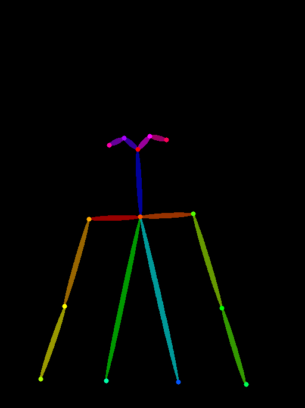
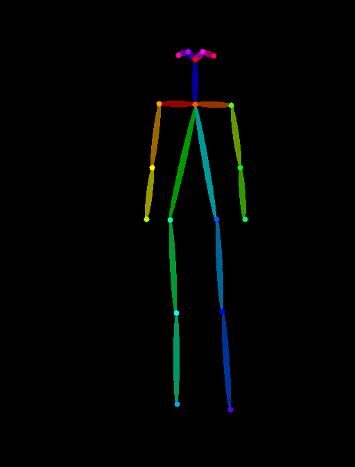
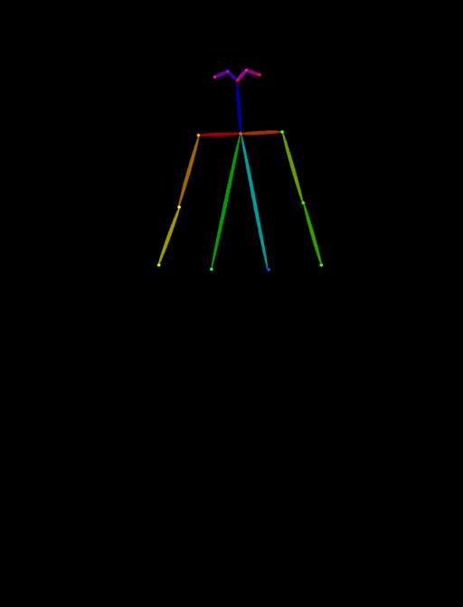

# ComfyUI LLM Promp

## LLM Prompt
QwenVL モデル を用いて V2T, I2T を自動で行うカスタムノード


### Install and setup

Add LLM Save Dir in your comfy UI models dir.  
```mkdir /LLM/Qwen2_5-VL-7B-Instruct```  
```mkdir /LLM/Qwen2_5-VL-3B-Instruct```


Download Qwen VL model and **put all file in each dir.**   
[Qwen/Qwen2.5-VL-3B-Instruct](https://huggingface.co/Qwen/Qwen2.5-VL-3B-Instruct)  
[Qwen/Qwen2.5-VL-7B-Instruct](https://huggingface.co/Qwen/Qwen2.5-VL-7B-Instruct)


Make shure your models dir is like

```
-models
    |- LLM
        |- Qwen2_5-VL-3B-Instruct
                |- config.json
                |- model-00001-of-00002.safetensors
                ...
        |- Qwen2_5-VL-7B-Instruct
                |- config.json
                |- model-00001-of-00005.safetensors
                ...
```


And write it in extra_model_pathes.yaml

Add LLM Save Path in 
    
```folder_paths.py```  
    
    folder_names_and_paths["LLM"] = ([os.path.join(models_dir, "LLM")], supported_pt_extensions)


## AlignPOSE_KEYPOINTToReference   

This module is a custom ComfyUI node that uses pose_keypoints_2d data obtained from OpenPose (or DWPose) to align reference images to the posture of an input image, specifically by scaling and shifting based on the neck position.  
The pose keypoint information of the reference image is used to align it to the input image.

- Supports the Body_18 format (OpenPose keypoint format)

- Scales the reference image based on the neck keypoint as the anchor.

### Demo

Origin Reference Pose ↓↓  
  

Input Image Pose (Target) ↓↓   
  

Use These Two Pose Image and Key Point to Align.

Aligned Image Pose ↓↓  

...


